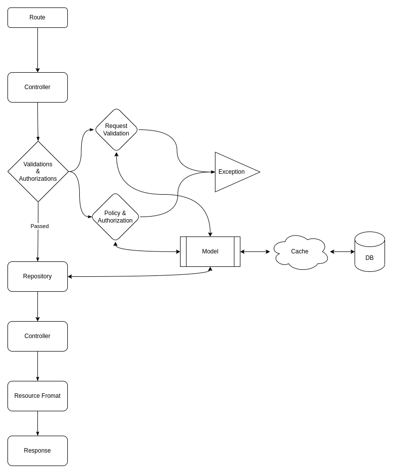

# Introduction
This package aim to provide auto file generation and base classes for the repository design pattern on Laravel.

Repository pattern forces you to have repository files in mediate between controllers and models, acting like a container where data access logic and business logic are stored.

### What is wrong with the MVC pattern?

MVC Violate the single responsibility principle in SOLID principles, where controller methods are responsible for the business logic and returning responses to the front-end users in the same time, making it impossible to re-use these methods or to independently testing the business logic in them.

### How repository design pattern works in this package?

After a request is being sent to the Laravel application, it follows these steps:

1. The route catch the request and redirect it to its method in the controller
2. The controller then validate the request with the correct [request file](https://laravel.com/docs/validation#creating-form-requests).
3. If the validations passed, the controller then check the [policy](https://laravel.com/docs/authorization#creating-policies) authorization if available.
4. If it passed the controller then call the repository to retrieve the required data.
5. The repository implement the business logic and call the model to retrieve the required data from the database accordingly.
6. The repository process that data (if needed) and return the final result to the controller
7. The controller passes that data to the [resource file](https://laravel.com/docs/eloquent-resources) to format the data as needed.
8. The controller finally return the response back to the user.

### Benefits of this design
1. Enforce single responsibility principle
2. Business logic, request authorization, and request validation can be tested separately
3. Prevent code duplication 
4. Cleaner and more intuitive code.
5. Allowing reusing business logic code across requests.
